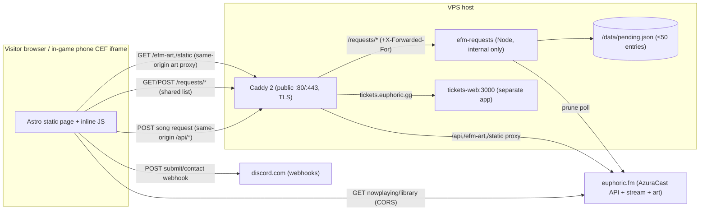
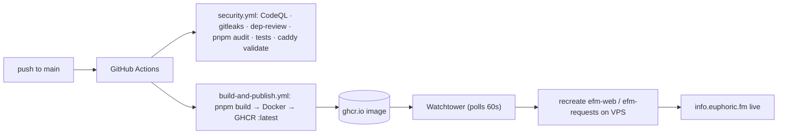
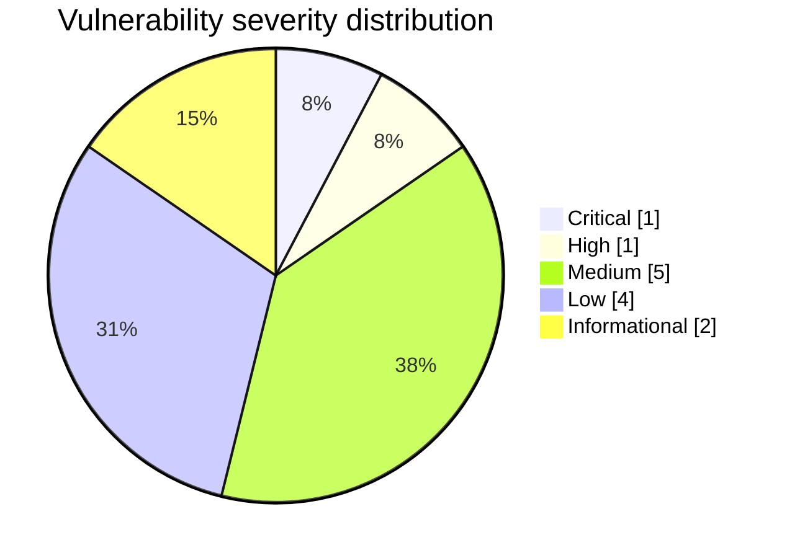

# Security Review Report — euphoricfm-website

- **Repository:** `jason-tucker/euphoricfm-website`
- **Reviewed commit:** `596e4f3` (baseline) → fixes on branch `claude/intelligent-albattani-kuoj5a`
- **Date:** 2026-06-09
- **Reviewer:** automated full-stack security + reliability pass (manual code tracing, not scanner-only)
- **Scope:** entire repository, threat-modelled as internet-facing and hostile-user-exposed.

## Executive summary

`euphoricfm-website` is a small (≈46-file) **Astro static site** for a GTA-RP
radio station, embedded in an in-game phone (FiveM CEF) iframe at
`info.euphoric.fm`, plus a **tiny zero-dependency Node service**
(`server/index.mjs`) that holds a shared "pending song requests" list. It is
served publicly by **Caddy** (direct Let's Encrypt TLS, no Cloudflare). There is
**no database, no user accounts/login, no session/JWT auth, no AI/LLM/RAG, and no
multi-tenancy** — so large parts of a generic "16-agent" review (auth/authz,
SQL/NoSQL injection, ORM, vector DB, model loading, Kubernetes/Terraform) have
essentially no surface here.

The one genuinely serious issue is a **stored XSS reachable by any anonymous
visitor**, which has been fixed on both the client and server. After this pass
the overall residual risk is **LOW**, with a short list of operator follow-ups
(rotate the historically-committed webhook URLs, enable branch protection +
GitHub secret scanning).

| | |
|---|---|
| **Overall risk before** | **High** (anonymous stored XSS affecting every visitor, no input validation, no CI security gates, no tests) |
| **Overall risk after** | **Low** |
| **Safe to deploy?** | Yes — changes are behaviour-preserving; build + 15 tests pass; rollback is a clean revert. Operator should still rotate webhooks and confirm the CSP in a CEF client before/after promoting. |
| **Biggest fixed issue** | Stored XSS via the unauthenticated `/requests/track` `art` field (CWE-79) |
| **Biggest remaining risk** | Watchtower `:latest` auto-deploy + RW docker.sock = wide blast radius if GHCR/CI is compromised (inherent to the chosen deploy design; documented, not changed) |

## Coverage

| Area | Status | Reason / evidence |
|---|---|---|
| Repo mapping / archaeology | completed | `THREAT_MODEL.md` system map; all 46 files read |
| Threat model | completed | `THREAT_MODEL.md` |
| Secrets (tree + full git history) | completed | history scan found webhook URLs in `5f27e19`; see F4 |
| Dependency / supply chain / SBOM | completed | `DEPENDENCY_AND_SBOM_NOTES.md`; `pnpm audit` = 0 known vulns |
| Static AppSec review | completed | findings register below (XSS sinks traced by hand) |
| Auth / authz | not applicable | no auth, accounts, sessions, or roles exist anywhere |
| API / backend | completed | the only backend is `server/index.mjs` (3 routes) — fully reviewed + tested |
| Frontend security / UX perf | completed | XSS sinks, CSP, exposed env vars, bundle (static, tiny) |
| AI / LLM / RAG / agent safety | not applicable | no AI/LLM/embeddings/agents/model files anywhere (grep-confirmed) |
| Infra / Docker / IaC | completed | Dockerfiles, compose, Caddyfile reviewed; already well-hardened |
| CI/CD security | completed | added `security.yml` + dependabot; hardened existing workflow |
| Testing / QA | completed | added first test suite (15 `node:test` cases) — `TEST_RESULTS.md` |
| Performance / scalability | completed | static site + 5s poll; notes in `THREAT_MODEL.md` / register |
| Database / data safety | not applicable | no DB; only state is a capped 50-entry JSON file |
| Observability / reliability | partial | added graceful shutdown; logging is JSON-to-stdout (already fine) |
| Release management | completed | `DEPLOYMENT_AND_ROLLBACK.md`; one semver bump (0.10.0) |
| DAST (ZAP) | not executed | no running staging target authorised in this environment |

## Findings register

Severity / confidence in parentheses. CWE mapped where applicable. "Status"
is `fixed`, `mitigated`, `documented` (accepted/needs operator), or `n/a`.

| ID | Sev | Conf | Category | File / line | Evidence & impact | Fix | Test | Status |
|---|---|---|---|---|---|---|---|---|
| F1 | **Critical** | High | Stored XSS (CWE-79) | `server/index.mjs` (POST `/requests/track`) → `src/scripts/nowplaying.ts` `renderPending()` (``) | `art` is stored verbatim from a public, unauthenticated endpoint and interpolated **unescaped** into an `` attribute rendered to *every* visitor; with no `script-src` CSP, `art = 'x" onerror="…'` runs arbitrary JS in all browsers (incl. the in-game phone). | Server `sanitizeArt()` rejects anything but a plain http(s)/root-relative URL; client HTML-escapes `art` on render (defence in depth). | `index.test.mjs`: "stored XSS in art is neutralised end-to-end" + `sanitizeArt` unit tests | **fixed** |
| F2 | Medium | High | XSS sink (CWE-79) | `src/components/RequestModal.astro:82`; `nowplaying.ts applyRecent()` | Same unescaped-`art` pattern, but sourced from AzuraCast (station-controlled) data rather than the anonymous endpoint → lower trust, same sink. | `art` now HTML-escaped at every interpolation site. | covered by escaping change + build | **fixed** |
| F3 | Medium | High | Missing rate limit / abuse (CWE-770) | `server/index.mjs` POST `/requests/track` | Public, unauthenticated, state-changing write with no throttling — allowed continuous churn/defacement of the shared list and log/CPU spam (bounded only by the 50-cap + 4 KB body). | Per-IP fixed-window limiter (20/min → 429); real client IP forwarded by Caddy (`X-Forwarded-For {remote_host}`). | `index.test.mjs`: "writes are rate-limited per IP" | **fixed** |
| F4 | **High** | High | Secrets in VCS history (CWE-540/798) | git history: `5f27e19` (`src/site.config.ts`), moved out in `e007775` | Real Discord webhook URLs were committed then removed; still retrievable from history. Impact is bounded because this architecture intentionally serves webhook URLs to every client, but committed credentials should always be rotated. | Removed from source already (pre-existing); added gitleaks CI; **operator must rotate** the webhooks (see Remaining Manual Actions). | gitleaks job in `security.yml` | **mitigated / operator action** |
| F5 | Medium | High | No CI security gates | `.github/workflows/` | No SAST, secret scan, dependency review, or test gate; `pnpm install` ran lifecycle scripts (Dockerfile used `--ignore-scripts`, CI did not). | Added `security.yml` (CodeQL, gitleaks, `pnpm audit`, server tests, `caddy validate`) + dependabot; added `--ignore-scripts` to the build install. (dependency-review pending repo Dependency Graph.) | new workflow runs on PR/push | **fixed** |
| F6 | Low | Med | Supply chain — actions on mutable tags (CWE-1357) | both workflows | Third-party actions referenced by moving tags (`@v4`, `@v3`) can be re-pointed. | Added Dependabot `github-actions` ecosystem to manage/bump versions; SHA-pinning recommended as the Dependabot-maintained follow-up. | n/a | **mitigated / follow-up** |
| F7 | Medium | High | Weak CSP | `Caddyfile` (info.euphoric.fm) | Only `frame-ancestors *` was set — no `script-src`/`connect-src`/`object-src`, so any injected script had unrestricted exfil/capability. | Added a behaviour-compatible CSP allow-listing exactly the origins the app uses (euphoric.fm, discord.com, self, data:). | `caddy validate` in CI; manual origin trace | **fixed** |
| F8 | Low | High | Quality gate disabled | `build-and-publish.yml` (`astro check` `continue-on-error: true`) | Typecheck failures never block the deploy image. | Left as-is (flipping risks breaking the live deploy on pre-existing type debt); documented. A dedicated `test` job now gates separately. | n/a | **documented** |
| F9 | Low | High | Deploy blast radius | `docker-compose.yml` (watchtower `:latest` + `/var/run/docker.sock`) | Auto-pulling `:latest` and a RW docker socket means anyone who can push to GHCR (or compromise CI/a dep) gets host RCE within ~60s. Inherent to the chosen auto-deploy design; watchtower needs RW socket. | Documented as accepted residual risk with mitigation options (digest pinning, scoped GHCR token). | n/a | **documented** |
| F10 | Low | High | Reliability — no graceful shutdown | `server/index.mjs` | On SIGTERM (every Watchtower redeploy) the process was killed mid-write, risking a truncated store and a leaked interval. | Added SIGTERM/SIGINT handler: flush + `server.close()` + timer clear. | manual | **fixed** |
| F11 | Info | High | Body-size accounting | `server/index.mjs` `readJsonBody` | Size check used JS string length on concatenated chunks (char, not byte) — effectively bounded but imprecise. | Now sums `Buffer` byte length and rejects precisely at `MAX_BODY_BYTES`. | `index.test.mjs`: "oversized bodies are rejected" | **fixed** |
| F12 | Low | High | Stored data hygiene | `server/index.mjs` | `title`/`artist` stored with raw control chars/newlines (XSS-safe via render-escaping, but messy). | `sanitizeText()` strips control chars + caps length. | `sanitizeText` unit test | **fixed** |
| F13 | Medium | Med | Broad reverse proxy | `Caddyfile` `handle /api/*` → euphoric.fm | All methods/paths under `/api/*` are proxied to AzuraCast (host pinned, so not arbitrary SSRF, but a broad same-origin API passthrough). | Left functional (scoping risks breaking request-submit); documented with a recommended tightened matcher. | n/a | **documented** |

> Note on auth/AI/DB rows being absent from the register: those classes were
> actively checked (grep + manual) and found to have **no surface** in this repo,
> not skipped. See Coverage.

## Changes made (grouped)

**Security (application)**
- `src/scripts/nowplaying.ts` — HTML-escape `art` in `renderPending()` and `applyRecent()`.
- `src/components/RequestModal.astro` — HTML-escape `art` in search-result rows.
- `server/index.mjs` — `sanitizeArt()` (URL allow-list), `sanitizeText()` (control-char strip), per-IP rate limiting, byte-accurate body limit, graceful shutdown, refactor to a side-effect-free `createStore()` factory.

**Infra / config**
- `Caddyfile` — behaviour-compatible CSP; forward real client IP to `/requests/*`.

**CI/CD**
- `.github/workflows/security.yml` — CodeQL, gitleaks, `pnpm audit`, server tests, `caddy validate` (dependency-review pending repo Dependency Graph).
- `.github/dependabot.yml` — npm + github-actions.
- `.github/workflows/build-and-publish.yml` — `--ignore-scripts` on install.

**Tests**
- `server/index.test.mjs` — 15 `node:test` cases; `pnpm test` script.

**Docs**
- `docs/security/*` — this report + threat model, remediation plan, SBOM notes, deploy/rollback, test results, security changelog.
- `CHANGELOG.md` / `package.json` — `0.10.0` section + version bump.

## Tests run

| Command | Result | Notes |
|---|---|---|
| `pnpm install --frozen-lockfile --ignore-scripts` | ✅ pass | 327 pkgs, clean |
| `pnpm build` | ✅ pass | static build, 1 page, ~3s; passes with `--ignore-scripts` |
| `pnpm audit` (prod + all) | ✅ 0 known vulnerabilities | see SBOM notes |
| `node --test server/*.test.mjs` | ✅ 15/15 pass | XSS, rate-limit, dedupe, cap, body-limit, prune, routes |
| `docker compose config -q` | ✅ valid | compose unchanged but re-validated |
| `caddy validate` | ⚠️ not run locally | docker daemon unavailable in review env; now gated in CI |

See `TEST_RESULTS.md` for full output.

## Deployment status

**Not deployed.** No staging target was provided/authorised in this environment,
and the safety rules forbid production deploys without explicit approval. All
changes are on `claude/intelligent-albattani-kuoj5a` as small, revertible
commits. See `DEPLOYMENT_AND_ROLLBACK.md` for the promotion path and rollback.

## Remaining manual actions

1. **Rotate the Discord webhook URLs** that were historically committed (F4) —
   regenerate them in the Discord channel settings and update `.env` on the host
   (`docker compose up -d`, no rebuild needed). Optional: rewrite git history to
   purge them (requires a force-push, which this pass intentionally did **not**
   perform).
2. **Enable GitHub secret scanning + push protection** and **branch protection**
   on `main` (require the new `security` checks + the build to pass; block force
   pushes). These are repo settings outside the code.
3. **Confirm the new CSP in a real FiveM CEF client** on staging before promoting
   (low risk — only allow-listed origins are used — but CEF is historically
   fragile here; rollback is a one-line revert).
4. **Decide on F9** (watchtower blast radius): keep `:latest` auto-deploy, or pin
   to image digests + use a scoped, least-privilege GHCR token.
5. **Optionally SHA-pin actions** (F6) once Dependabot opens its first PRs.
6. Configure CI/host secrets for any new environments (`PUBLIC_DISCORD_*_WEBHOOK`).

## Diagrams

### System / data-flow

### Deployment pipeline

### Severity distribution

